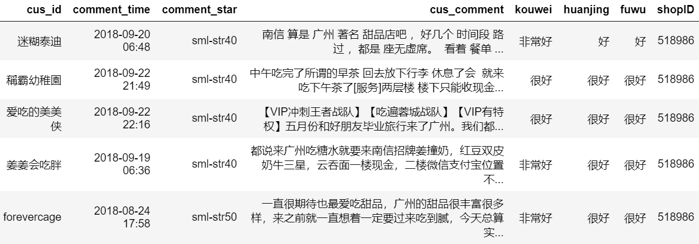
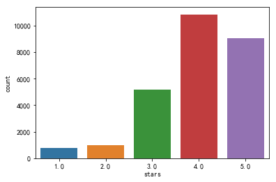
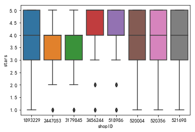
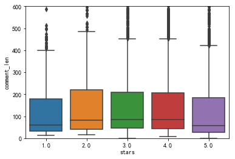

# 大众点评评论文本挖掘

[TOC]

## 一、爬虫

### 整体思路

爬取大众点评十大热门糖水店的评论，爬取网页后从html页面中把需要的字段信息（顾客id、评论时间、评分、评论内容、口味、环境、服务、店铺ID）提取出来并存储到MYSQL数据库中。

### 网页爬取和解析

链接格式为"http://www.dianping.com/shop/" + shopID + "/review_all/" + pi，如：http://www.dianping.com/shop/518986/review_all/p1 ，一页评论有20条。我们使用for循环构造链接URL，使用requests库发起请求并把html页面爬取下来，通过BeautifulSoup和re库解析页面提取信息。

我们发现完整的评论都存储在'div','main-review'中，且部分页面口味、环境、服务并不是每一页都有，因此需要使用try...except...防止程序中断，BeautifulSoup部分代码如下：

``` python
for item in soup('div','main-review'):
    cus_id = item.find('a','name').text.strip()
    comment_time = item.find('span','time').text.strip()
    comment_star = item.find('span',re.compile('sml-rank-stars')).get('class')[1]
    cus_comment = item.find('div',"review-words").text.strip()
    scores = str(item.find('span','score'))
    try:
        kouwei = re.findall(r'口味：([\u4e00-\u9fa5]*)',scores)[0]
        huanjing = re.findall(r'环境：([\u4e00-\u9fa5]*)',scores)[0]
        fuwu = re.findall(r'服务：([\u4e00-\u9fa5]*)',scores)[0]
        except:
            kouwei = huanjing = fuwu = '无'
```

### 数据存储

我们使用MYSQL数据库，安装教程参考[菜鸟教程](http://www.runoob.com/mysql/mysql-install.html)，python连接MYSQL数据推荐使用pymysql，同样是推荐菜鸟教程[菜鸟教程](http://www.runoob.com/python3/python3-mysql.html)。我们需要先建立一个数据库和表，然后连接并定义游标，然后写对应的sql语句，最后执行事务，存储部分的代码如下：

``` python
#连接MYSQL数据库
db = pymysql.connect("localhost","root","","TESTDB" )
cursor = db.cursor()
#存储爬取到的数据
def save_data(data_dict):
    sql = '''INSERT INTO DZDP(cus_id, comment_time, comment_star, cus_comment, kouwei, huanjing,           fuwu, shopID) VALUES(%s,%s,%s,%s,%s,%s,%s,%s)'''
    value_tup = (data_dict['cus_id']
                 ,data_dict['comment_time']
                 ,data_dict['comment_star']
                 ,data_dict['cus_comment']
                 ,data_dict['kouwei']
                 ,data_dict['huanjing']
                 ,data_dict['fuwu']
                 ,data_dict['shopID']
                 )
    try:
        cursor.execute(sql,value_tup)
        db.commit()
    except:
        print('数据库写入失败')
    return
```

### 反爬虫对抗

1. **修改请求头中浏览器信息**：使用fake_useragent第三方库，修改request中的headers参数，用法如下：

   ``` python
   from fake_useragent import UserAgent
   ua = UserAgent()
   headers = {'User-Agent':ua.random}
   ```

2. **设置跳转路径**：在访问评论时，一般的浏览行为是从某一页跳转到下一页这样的，而不是直接通过连接访问，为了更好的伪装成一个正常的访问，我们需要设置一下跳转的路径，修改headers中的Referer参数

   ``` python 
   headers = {
           'User-Agent':ua.random,
           'Cookie':cookie,
           'Referer': 'http://www.dianping.com/shop/518986/review_all'
   }
   ```

3. **设置Cookies**：评论数据需要登录后才能获取，下面介绍一种非常简单方便的绕过登录的方法。

   - 在网页上进行登录
   - 使用Chrome浏览器的开发者工具，查询当前请求的cookie
   - 复制浏览器中的cookie，使用此cookie对我们的请求进行伪装

4. **使用IP代理池**：这里使用西刺代理的免费代理，构建一个爬虫爬取西刺代理的ip，然后进行验证，筛掉不可用的ip，构建出ip池供后续调用，代码来自网络。但是经过测试，大众点评对一个账号不同ip访问监控非常严格，使用IP代理池不更换账号的话，死的更快，封你账号，然而构建账号池比较麻烦，我们先暂缓。

5. **降低爬取频率**：一个简单又有效的方法就是降低爬取频率，毕竟高频率的爬取对服务器也是一个考验，如果对速度的要求不是很高的话，建议把频率放慢一点，你好我好大家好！

   ``` python
   import random
   import time
   time.sleep(6*random.random() + 4)
   ```

6. **设置断点续传**：即使降低了爬取频率，有时还是会被美团的网络工程师抓到的，小哥哥饶命啊~。因此我们需要一个断点续传的小功能，避免每次都从头开始爬。思路是建一个文本文件，存储当前爬取的进度，每次运行程序时都出当前进度开始，详见代码~

## 二、探索性分析与文本数据预处理

### 探索性分析

1. 查看数据大小以及基础信息 ，浏览数据

   

2. 样本分布

   

3. 各店铺评分分布

   

4. 点评数的的时间分布

   

5. 查看评论长度对结果影响

   
### 数据预处理

1. **去除非文本数据**：可以看出，爬虫获取的数据非常多类似“\xa0”的非文本数据，而且都还有一些无意义的干扰数据，如结尾的“收起评论” 

   ``` python
   #除去非文本数据和无意义文本
   data['cus_comment'] = data['cus_comment'].str.replace(r'[^\u4e00-\u9fa5]','').str.replace('收起评论','')
   ```

2. **中文分词**：中文文本数据处理，怎么能离开中文分词呢，我们使用jieba库，简单又好用。这里我们把文本字符串处理为以空格区隔的分词字符串 
   ``` python
   #中文分词
   import jieba
   data['cus_comment'] = data['cus_comment'].apply(lambda x:' '.join(jieba.cut(x)))
   ```

3. **去除停用词**：文本中有很多无效的词，比如“着”，“和”，还有一些标点符号，这些我们不想在文本分析的时候引入，因此需要去掉，因为wordcloud和TF-IDF都支持停用词，因此就不额外处理了 

### 词云展示


## 三、文本的情感分析

先上结果：

| 糖水店的评论文本                             | 模型预测的情感评分 |
| :------------------------------------------- | :----------------- |
| '糖水味道不错，滑而不腻，赞一个，下次还会来' | 0.91               |
| '味道一般，没啥特点'                         | 0.52               |
| '排队老半天，环境很差，味道一般般'           | 0.05               |

模型的效果还可以的样子，yeah~接下来我们好好讲讲怎么做的哈，我们通过爬虫爬取了大众点评广州8家最热门糖水店的3W条评论信息以及评分作为训练数据，前面的分析我们得知*样本很不均衡*。接下来我们的整体思路就是：文本特征提取(TF-IDF)—机器学习建模—模型评价。

我们先不处理样本不均衡问题，直接建模后查看结果，接下来我们再按照两种方法处理样本不均衡，对比结果。

### 文本特征提取（TF-IDF）

模型不能直接处理文本数据，因此需要先把文本数据转为向量，方法有词库表示法、TF-IDF、word2vec等，推荐一篇文章，总结得不错 https://zhuanlan.zhihu.com/p/44917421。

``` python
#使用TF-IDF进行文本转向量处理
from sklearn.feature_extraction.text import TfidfVectorizer
tv = TfidfVectorizer(stop_words=stopwords, max_features=3000, ngram_range=(1,2))
tv.fit(x_train)
```

### 机器学习建模

这里我们使用文本分类的经典算法朴素贝叶斯算法，而且朴素贝叶斯算法的计算量较少。特征值是评论文本经过TF-IDF处理的向量，标签值评论的分类共两类，好评是1，差评是0。情感评分为分类器预测分类1的概率值。 

``` python
#计算分类效果的准确率
from sklearn.naive_bayes import MultinomialNB
from sklearn.metrics import roc_auc_score, f1_score
classifier = MultinomialNB()
classifier.fit(tv.transform(x_train), y_train)
classifier.score(tv.transform(x_test), y_test)

>>>0.9275308869629356
```

可以看出，准确率非常不错的样子 

``` python
#从大众点评网找两条评论来测试一下
test1 = '很好吃，环境好，所有员工的态度都很好，上菜快，服务也很好，味道好吃，都是用蒸馏水煮的，推荐，超好吃' #5星好评
test2 = '糯米外皮不绵滑，豆沙馅粗躁，没有香甜味。12元一碗不值。' #1星差评
print('好评实例的模型预测情感得分为{}\n差评实例的模型预测情感得分为{}'.format(ceshi(classifier,test1),ceshi(classifier,test2)))

>>>好评实例的模型预测情感得分为0.8638082706675478
>>>差评实例的模型预测情感得分为0.7856544482460911
```

点评网上的实际测试中，5星好评模型预测出来了，1星差评缺预测错误。为什么呢？我们查看一下**混淆矩阵** 

```
[  46,  385]
[   8, 4984]
```

可以看出，**负类的预测非常不准**，433单准确预测为负类的只有15.7%，应该是由于**数据不平衡**导致的，模型的默认阈值为输出值的中位数。比如逻辑回归的输出范围为[0,1]，当某个样本的输出大于0.5就会被划分为正例，反之为反例。在数据的类别不平衡时，采用默认的分类阈值可能会导致输出全部为正例，产生虚假的高准确度，导致分类失败。

处理样本不均衡问题的方法，首先可以选择调整阈值，使得模型对于较少的类别更为敏感，或者选择合适的评估标准，比如ROC或者F1，而不是准确度（accuracy）。另外一种方法就是通过采样（sampling）来调整数据的不平衡。其中欠采样抛弃了大部分正例数据，从而弱化了其影响，可能会造成偏差很大的模型，同时，数据总是宝贵的，抛弃数据是很奢侈的。另外一种是过采样，下面我们就使用过采样方法来调整。

###　样本数据不平衡

最简单的过采样方法，就是简单复制法。但单纯的重复了反例，会过分强调已有的反例。如果其中部分点标记错误或者是噪音，那么错误也容易被成倍的放大。因此最大的风险就是对反例过拟合。 

``` python
#把0类样本复制10次，构造训练集
index_tmp = y_train==0
y_tmp = y_train[index_tmp]
x_tmp = x_train[index_tmp]
x_train2 = pd.concat([x_train,x_tmp,x_tmp,x_tmp,x_tmp,x_tmp,x_tmp,x_tmp,x_tmp,x_tmp,x_tmp])
y_train2 = pd.concat([y_train,y_tmp,y_tmp,y_tmp,y_tmp,y_tmp,y_tmp,y_tmp,y_tmp,y_tmp,y_tmp])

#使用过采样样本(简单复制)进行模型训练，并查看准确率
clf2 = MultinomialNB()
clf2.fit(tv.transform(x_train2), y_train2)
y_pred2 = clf2.predict_proba(tv.transform(x_test))[:,1]
roc_auc_score(y_test,y_pred2)

>>>0.9049699937533463
```

查看此时的混淆矩阵

```
[ 331,  100]
[ 637, 4355]
```

可以看出，即使是简单粗暴的复制样本来处理样本不平衡问题，负样本的识别率大幅上升了，变为77%，满满的幸福感呀~还有SMOTE过采样算法，SMOTE是在局部区域通过K-近邻生成了新的反例。相较于简单的过采样，SMOTE降低了过拟合风险，但同时运算开销加大，详细请看具体代码~

### 模型评估测试

我们把3W条数据都拿来训练，数据量变多了，模型效果应该会更好

``` python
def fenxi(strings):
    strings_fenci = fenci(pd.Series([strings]))
    return float(clf.predict_proba(tv2.transform(strings_fenci))[:,1])

#到网上找一条差评来测试一下
fenxi('糯米外皮不绵滑，豆沙馅粗躁，没有香甜味。12元一碗不值。')

>>>0.28900092243477077
```

只用到了简单的机器学习，就做出了不错的情感分析效果，知识的力量真是强大呀，666~

## 四、拓展应用及后续方向

- 使用更复杂的机器学习模型如神经网络、支持向量机等
- 模型的调参
- 行业词库的构建
- 增加数据量
- 优化情感分析的算法
- 增加标签提取等
- 项目部署到服务器上，更好地分享和测试模型的效果